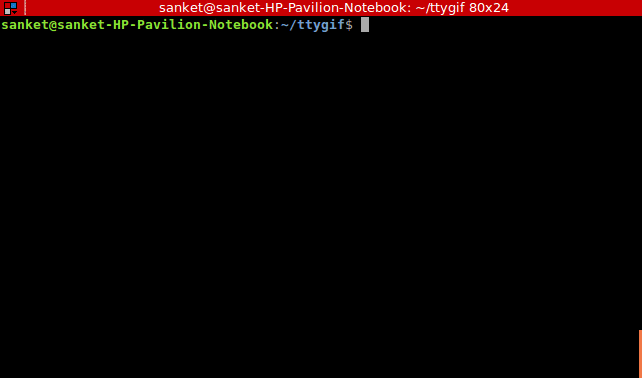

# cppcli
Test c++ code snippets in the terminal.


## Why?

Suppose you want to find out the output of some code snippet.

```
cout<<"i""am""good"<<endl;
```
Strangely, the output is iamgood.

There are many such idiosyncrasies of the c++ language. But it annoying to type out the main function and the preprocessor directives etc and then compile the file and execute it when all I really wanted to do was to find the output of a small code snippet.

In python all you have to do is type
```
python
```
and then type the lines of code that interests you.
So, I created something that does the same for c++.


## Demo




## Installation
```
$ git clone https://github.com/sanketkumarsinghiitkgp/cppcli
$ cd cppcli
$ sh install.sh
```
## Usage

```
$ cppcli
$ //type your cpp code snippet here
$ //when you have to end enter 'end'
$ //enter 'man' to list all available commands
```